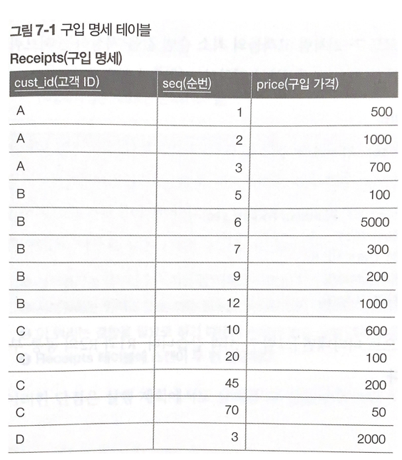
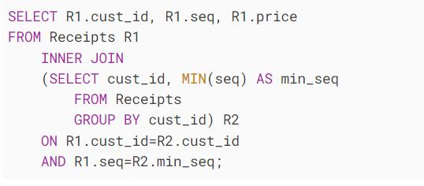
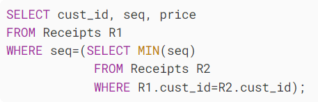
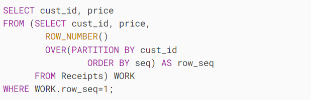
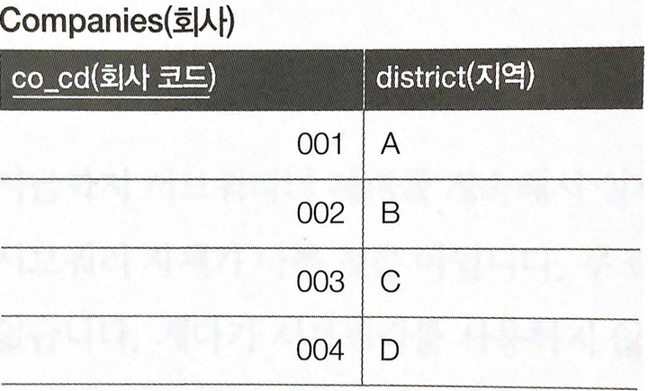
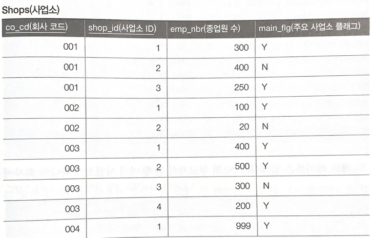
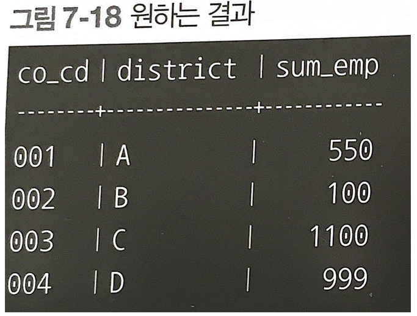
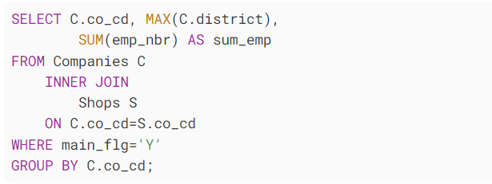
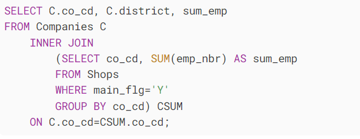

# 서브쿼리
* 서브쿼리란?

하나의 SQL 문에 포함되어 있는 또 다른 SQL 문을 말합니다.

## 서브쿼리 문제점
서브쿼리는 실체적인 데이터를 저장하고 있지 않습니다. 따라서 연산비용 추가, 데이터I/O 비용 발생, 최적화를 받을 수 없음 

## 서브쿼리 의존증
 고객별로 최소 순번을 가진 레코드 구하기

서브쿼리를 사용할때

단점:
 1. 가독성이 떨어진다. 
 2. 성능이 떨어진다. 
 * 서브쿼리는 대부분 일시적인 영역에 확보되므로 오버헤드가 생긴다.
 * 서브쿼리는 인덱스 또는 제약정보를 가지지 않기 때문에 최적화되지 못한다.
* 이 쿼리는 결합을 필요로 하기 때문에 비용이 높고 실행계획 변동 리스크 발생한다.
* receipts테이블에 두번의 스캔이 필요하다.

**실행계획: SQL을 실행하는데 있어 사용되는 cost와 어떠한 방식이 가장 적절한지 판단하고, 올바른 플랜 중 평가하여 어떠한 순서와 방식으로 처리할 것인지 계획을 세우고 필요에 따라 변경하여 성능을 개선하는데 사용된다.

### 상관 서브쿼리를 사용한 동치변환

** 상관 서브쿼리: 부모 명령과 자식인 서브쿼리가 특정 관계를 맺는 것을 상관 서브쿼리라 한다.

 (상관 서브쿼리는 부모 명령과 연관되어 처리되기 때문에 단독으로 실행할 수 없다.
상관 서브쿼리가 아닌 단순한 서브쿼리는 단독 쿼리로 실행할 수 있다.)

-> 테이블에 2번접근하기 때문에 성능에 큰 차이는 없다.

### 윈도우 함수로 결합을 제거
** 윈도우 함수 : 행과 행 간의 관계를 쉽게 정의하기 위해 만든 함수가 윈도우 함수입니다.
여기서는 ROW_NUMBER 사용했다.

->테이블 접근이 1회로 감소 

#### 결합을 사용한 쿼리의 불안정요소
* 결합알고리즘의 변동 리스크
* 환경요인에 의한 지연 리스크(인덱스,메로리,매개변수 등)

1. 알고리즘 변동 리스크 
결합알고리즘 종류
* Nested Loops 

        중첩 반복을 사용하는 알고리즘

* Sort Merge
             
        두 테이블을 각각 조건에 맞게 먼저 읽는다.
        그리고 읽은 두 테이블을 조인 컬럼을 기준으로 정렬해놓고, 조인을 수행한다. 주로 조인 조건 칼럼에 인덱스가 없거나, 출력해야 할 결과 값이 많을 때 사용된다.

* Hash 
            
        조인될 두 테이블 중 하나를 해시 테이블로 선정하여 조인될 테이블의 조인 키 값을 해시 알고리즘으로 비교하여 매치되는 결과값을 얻는 방식,주로 많은 양의 데이터를 조인해야 하는 경우에 주로 사용됩니다.

   
테이블의 크기 등을 고려해 옵티마이저가 자동으로 결정한다

예를 들어 레코드수가 적은 테이블이 포함되었다면 Nestedd loops가 선택되고 큰 테이블들을 결합하는 겨우엥는 sort merge나 hash가 주로 선택됩니다.

처음에 nested loops를 사용하다가 레코드 수가 늘어나 역치를 넘으면 실행계획에 변동이 생기고 이때 성능에 큰 변화가 일어납니다.

#### 실행계획이 단순할수록 성능은 안정적, 엔지니어는 기능뿐만 아니라 비기능적인 부분도 보장할 책임이 있다.

### 서브쿼리를 사용해야 하는 경우

결합과 관련된 쿼리에서는 서브쿼리가 성능에 유리하다.

결합할때 결합대상 레코드 수를 줄이는 것이 중요한데 옵티마이저가 잘 판별하지 못할 때는 사라밍 직접 연산 순서를 명시해주면 좋은 결과를 얻을 수 있다.

#### 회사마다 주요 사업소의 총 직원수(sum_emp)를 구하기

 ##### 결합을 먼저하는 경우
 

1. 회사테이블 레코드 4개

2. 사업소 테이블 레코드 10개
 ##### 집약을 먼저하는 경우
 

 1. 회사테이블 레코드 4개

2. 사업소 테이블 레코드 4개

### ==> 사전에 결합 레코드 수를 압축하는것 