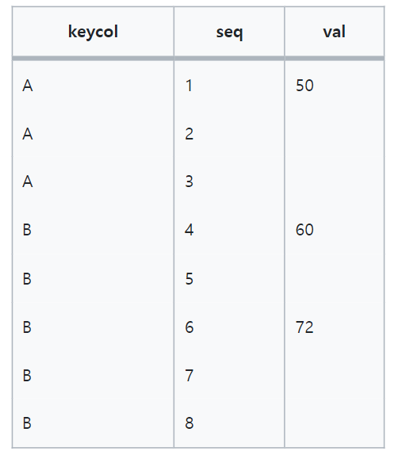
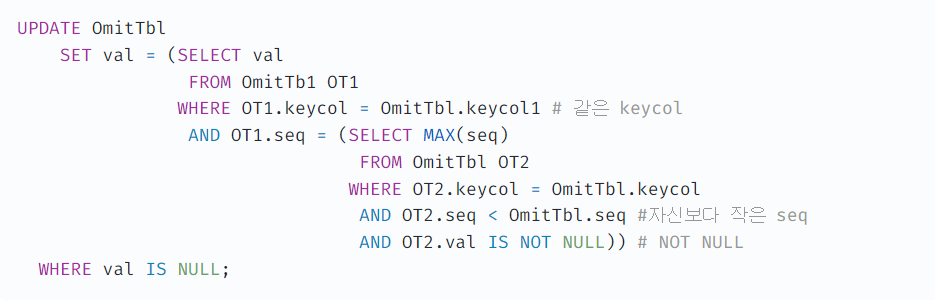
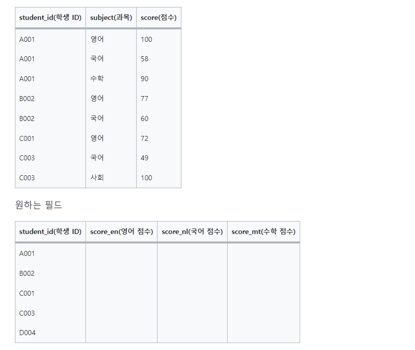
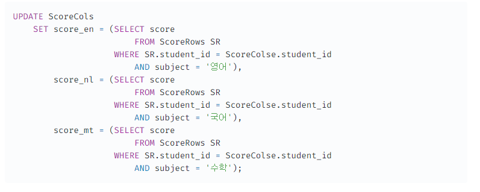
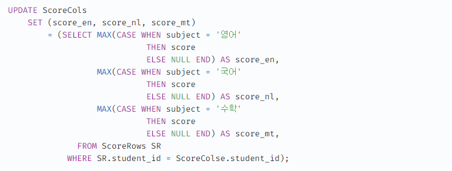
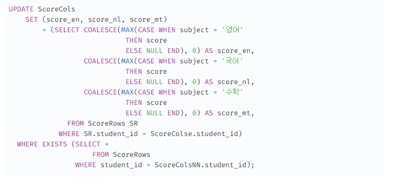

# 갱신과 데이터모델

## 갱신은 효율적으로

### 널값 채우기

빈칸은 이전값과 같은 값을 의미한다.
빈칸에 값을 채우고 싶다면?

사용된 조건은 1. 같은 keycol 2. 현재 레토드보다 작은 seq필드 3. val필드가 null이 아님

### 레코드에서 필드로의 갱신

위 테이블을 아래 테이블로 변환할때

#### 필드를 하나씩 갱신

-> 명확하지만 비효율적

여러개의 필드를 리스트화하고 한번에 갱신하는 방법

* 2014년 기준으로 oracle과 db2에서만 사용가능

위 쿼리 사용시 테이블 접근이 1번으로 감소

not null 제약이 있는 경우

처음부터 테이블 사이에 일치하지 않는 레코드가 존재하는 경우: D004학생 
=> WHERE구의 EXISTS를 사용해 ID가 일치하는 레코드 한정이라는 조건을 추가해 해결

학생은 존재하지만 과목이 없는 경우:B002,C003의 수학이 이에 해당하는데 COALESCE함수로 NULL을 0으로 변경해 대응

### 같은 테이블 내에 다른 레코드정보로 갱신
1. 상관 서브쿼리 사용(INSERT SELECT)
2. 윈도우 함수 사용

#### INSERT SELECT 장점

- 처리가 더 빠름
- 자기참조를 허가하지 않는 DB에서도 사용가능

단점

- 같은 데이터를 두개 만들어야하므로 저장소를 2배 이상 소비
- 뷰로 만들어도 되나 트레이드 오프가 있다